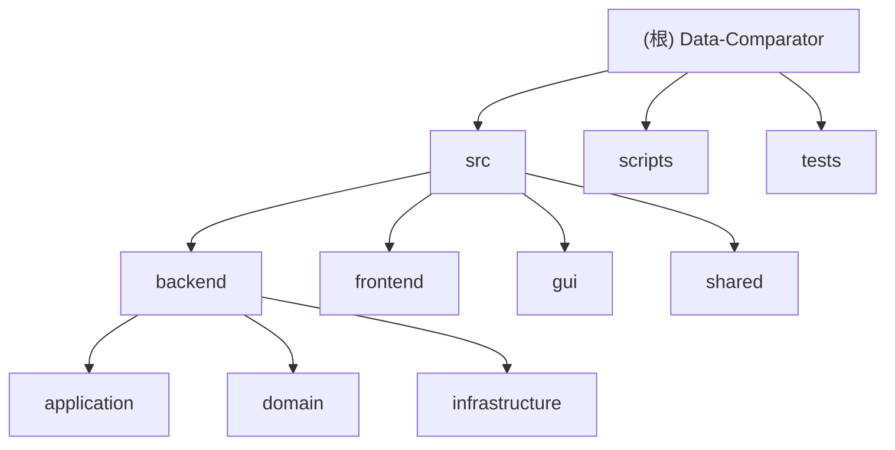

# Data-Comparator 项目指南

## 项目愿景

Data-Comparator 是一个面向 Excel 数据集版本差异分析的 Python 工具。当前项目以 Linux Web/API 运行入口为主，保留历史桌面 GUI 与 Windows 打包脚本用于兼容和迁移参考。核心目标是稳定、可观测地比较新旧数据集，输出带高亮、汇总、Sheet 状态标记的 Excel 比对报告。

## 架构总览

项目采用分层结构：

- `src/frontend`：Web API 与 GUI 运行时辅助层，对外暴露 FastAPI 接口，或向 Tkinter 主线程投递 GUI 更新。
- `src/backend/application`：应用编排层，负责路径校验、输出路径生成、配置装配与调用领域比对流程。
- `src/backend/domain`：领域层，负责 Excel Sheet 读取、锚点构造、差异识别、高亮写回、停止控制与结果容器。
- `src/backend/infrastructure`：基础设施层，负责配置持久化、运行时临时目录、Excel 文件预处理、进度管理。
- `src/gui`：历史桌面 GUI，负责配置管理、参数编辑、日志文件与线程化调用领域流程。
- `src/shared`：跨层类型契约、日志与资源路径工具。
- `scripts`：Windows/PyInstaller/Nuitka 打包脚本与版本资源。
- `tests`：pytest 单元、接口、导入烟测和中断传播测试。

### 模块结构图



## 模块索引

| 模块 | 职责 | 入口/接口 | 测试与质量 | 文档 |
|---|---|---|---|---|
| `src` | Python 包根与运行入口聚合 | `src/main_web.py`, `src/main.py` | 导入烟测覆盖包可导入性 | [`src/CLAUDE.md`](./src/CLAUDE.md) |
| `src/backend` | 后端分层聚合 | 由 application/domain/infrastructure 子层提供 | 子模块测试覆盖主要流程 | [`src/backend/CLAUDE.md`](./src/backend/CLAUDE.md) |
| `src/backend/application` | 应用编排、路径校验、输出命名 | `run_comparison`, `validate_processing_paths`, `build_output_path` | `tests/test_comparison_runner.py`, `tests/test_processing_service.py` | [`src/backend/application/CLAUDE.md`](./src/backend/application/CLAUDE.md) |
| `src/backend/domain` | Excel 比对核心、Sheet 读取、高亮、停止控制 | `process_edc_multithreaded`, `perform_full_comparison`, `read_single_sheet_from_excel` | 中断传播、结果容器、高亮优化器测试 | [`src/backend/domain/CLAUDE.md`](./src/backend/domain/CLAUDE.md) |
| `src/backend/infrastructure` | 配置仓库、文件运行时、线程安全进度 | `JsonParameterRepository`, `ConfigManager`, `ThreadSafeProgressManager` | 参数仓库、进度管理测试 | [`src/backend/infrastructure/CLAUDE.md`](./src/backend/infrastructure/CLAUDE.md) |
| `src/frontend` | FastAPI Web API 与 GUI 更新队列 | `app`, `/health`, `/api/compare`, `GUIUpdateManager` | `tests/test_web_api.py` | [`src/frontend/CLAUDE.md`](./src/frontend/CLAUDE.md) |
| `src/gui` | 历史 Tkinter/ttkbootstrap GUI | `DatasetComparatorGUI`, `ParameterManager` | 主要通过导入烟测与后端测试间接覆盖 | [`src/gui/CLAUDE.md`](./src/gui/CLAUDE.md) |
| `src/shared` | TypedDict 契约、日志、资源路径 | `ParameterDocument`, `log`, `get_resource_path` | `tests/test_log_utils.py`, import smoke | [`src/shared/CLAUDE.md`](./src/shared/CLAUDE.md) |
| `scripts` | Windows 构建与打包 | `build_script.py`, `build.bat`, `build_with_nuitka.bat`, `app.spec` | 未发现自动化测试 | [`scripts/CLAUDE.md`](./scripts/CLAUDE.md) |
| `tests` | pytest 测试资产 | `pytest` | 10 个测试文件覆盖应用层、API、基础设施、领域辅助 | [`tests/CLAUDE.md`](./tests/CLAUDE.md) |

## 运行与开发

### 安装

```bash
python -m pip install -e .
python -m pip install -e .[dev]
```

项目要求 Python `>=3.8`。主要依赖包括 `pandas`、`numpy`、`openpyxl`、`fastapi`、`pydantic`、`uvicorn`、`ttkbootstrap`、`appdirs`，Windows GUI/打包路径还会使用 `pywin32`。

### Web/API 入口

优先使用 Web/API 入口：

```bash
DATASET_COMPARATOR_WEB_HOST=0.0.0.0 DATASET_COMPARATOR_WEB_PORT=8000 dataset-comparator-web
# 或
DATASET_COMPARATOR_WEB_HOST=0.0.0.0 DATASET_COMPARATOR_WEB_PORT=8000 python -m src.main_web
```

主要接口：

```bash
curl http://127.0.0.1:8000/health

curl -X POST http://127.0.0.1:8000/api/compare \
  -H 'Content-Type: application/json' \
  -d '{
    "old_file_path": "/data/old.xlsx",
    "new_file_path": "/data/new.xlsx",
    "output_directory": "/data/output"
  }'
```

### 历史 GUI 入口

GUI 保留用于兼容：

```bash
dataset-comparator-gui
python run.py
python -m src.main
```

当前未来运行目标是 Linux Web Runtime；除非需求明确要求，不要把新能力优先设计为桌面 GUI 专属能力。

### 构建脚本

- PyInstaller：`scripts/build.bat` 调用 `scripts/build_script.py` 与 `scripts/app.spec`。
- Nuitka：`scripts/build_with_nuitka.bat`，说明见 `scripts/README_Nuitka.md`。
- 构建产物目录 `build/`、`dist/`、`dist_nuitka/` 被忽略，不应纳入源码审查。

## 测试策略

项目使用 pytest，配置在 `pyproject.toml`：

```bash
pytest
pytest -v --tb=short --strict-markers
```

如需覆盖率报告，可安装 `pytest-cov` 后运行：

```bash
pytest --cov=src --cov-report=term-missing
```

当前测试重点：

- Web API 健康检查、比对成功路径、异常到 HTTP 状态码的映射。
- `run_comparison` 应用编排、输出路径、依赖注入和异常传播。
- 路径校验、输出名清洗、不可变式返回新 mapping。
- 参数仓库 JSON 持久化和非法文档校验。
- 线程安全进度管理。
- 停止控制与 `InterruptedError` 在领域层、文件运行时中的传播。
- 高亮优化器缓存行为。
- 包与关键模块导入烟测。

## 编码规范

- Python 代码遵循 PEP 8，新增/修改函数签名应包含类型标注。
- 质量工具配置在 `pyproject.toml`：`black` 行宽 88、`isort` 使用 black profile、`mypy` 忽略缺失第三方导入。
- 外部输入在系统边界验证：Web API 使用 Pydantic，应用层使用 `validate_processing_paths` 校验路径。
- 关键路径必须显式处理错误，不要静默吞错；用户主动停止应传播 `InterruptedError`。
- 避免就地修改共享对象；应用层已有 `apply_processing_paths` 返回新 mapping 的模式，新增逻辑应优先复用。
- `src/backend/domain/data_comparison.py` 是复杂核心文件，修改前必须先阅读相关测试并增加针对性用例。
- 不要读取或修改忽略目录、缓存、构建产物；二进制资源仅记录路径。

## AI 使用指引

- 处理 Web/API 需求时优先查看 `src/main_web.py`、`src/frontend/web_api.py`、`src/backend/application/comparison_runner.py`。
- 处理 Excel 比对差异时优先查看 `src/backend/domain/data_comparison.py`、`src/backend/domain/excel_header_utils.py`、`src/backend/domain/excel_utils.py`。
- 处理配置持久化时优先查看 `src/backend/infrastructure/parameter_repository.py` 与 `src/gui/parameter_manager.py`。
- 处理停止/取消任务时必须检查 `processing_control.py`、相关测试与 `InterruptedError` 传播链。
- 修改公共契约时同步检查 `src/shared/contracts.py`、Web API 请求模型、GUI 参数收集、配置仓库与测试。
- 安全要求：不要硬编码密钥；不要打印或写入敏感路径以外的数据内容；不要将用户 Excel 内容写入文档或日志样例。
- Git 要求：不主动提交；提交前必须查看 diff；禁止 force push 到 `main`/`master`。

## 变更记录 (Changelog)

| 时间 | 类型 | 说明 |
|---|---|---|
| 2026-05-24T03:25:49 | docs | 初始化项目架构索引，生成根级与模块级 Claude 指南。 |
