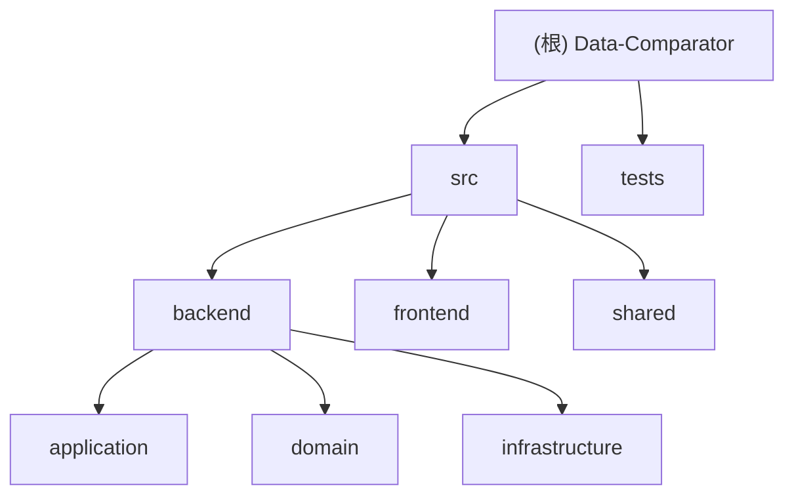

# Data-Comparator 项目指南

## 项目愿景

Data-Comparator 是一个面向 Excel 数据集版本差异分析的 Python 工具。当前项目为 Linux Web/API 运行。核心目标是稳定、可观测地比较新旧数据集，输出带高亮、汇总、Sheet 状态标记的 Excel 比对报告。

## 架构总览

项目采用分层结构：

- `src/frontend`：Web API 层，对外暴露 FastAPI 接口。
- `src/backend/application`：应用编排层，负责路径校验、输出路径生成、配置装配与调用领域比对流程。
- `src/backend/domain`：领域层，负责 Excel Sheet 读取、锚点构造、差异识别、高亮写回、停止控制与结果容器。
- `src/backend/infrastructure`：基础设施层，负责配置持久化、运行时临时目录、Excel 文件预处理、进度管理。
- `src/shared`：跨层类型契约与日志工具。
- `tests`：pytest 单元、接口、导入烟测和中断传播测试。

### 模块结构图


```mermaid
graph TD
    A["(根) Data-Comparator"] --> SRC["src"];
    SRC --> BACKEND["backend"];
    BACKEND --> APP["application"];
    BACKEND --> DOMAIN["domain"];
    BACKEND --> INFRA["infrastructure"];
    SRC --> FRONTEND["frontend"];
    SRC --> SHARED["shared"];
    A --> TESTS["tests"];

    click SRC "./src/CLAUDE.md" "查看 src 模块文档"
    click BACKEND "./src/backend/CLAUDE.md" "查看 backend 模块文档"
    click APP "./src/backend/application/CLAUDE.md" "查看 application 模块文档"
    click DOMAIN "./src/backend/domain/CLAUDE.md" "查看 domain 模块文档"
    click INFRA "./src/backend/infrastructure/CLAUDE.md" "查看 infrastructure 模块文档"
    click FRONTEND "./src/frontend/CLAUDE.md" "查看 frontend 模块文档"
    click SHARED "./src/shared/CLAUDE.md" "查看 shared 模块文档"
    click TESTS "./tests/CLAUDE.md" "查看 tests 模块文档"
```

## 模块索引

| 模块 | 职责 | 入口/接口 | 测试与质量 | 文档 |
|---|---|---|---|---|
| `src` | Python 包根与运行入口聚合 | `src/main_web.py` | 导入烟测覆盖包可导入性 | [`src/CLAUDE.md`](./src/CLAUDE.md) |
| `src/backend` | 后端分层聚合 | 由 application/domain/infrastructure 子层提供 | 子模块测试覆盖主要流程 | [`src/backend/CLAUDE.md`](./src/backend/CLAUDE.md) |
| `src/backend/application` | 应用编排、路径校验、输出命名 | `run_comparison`, `validate_processing_paths`, `build_output_path` | `tests/test_comparison_runner.py`, `tests/test_processing_service.py` | [`src/backend/application/CLAUDE.md`](./src/backend/application/CLAUDE.md) |
| `src/backend/domain` | Excel 比对核心、Sheet 读取、高亮、停止控制 | `process_edc_multithreaded`, `perform_full_comparison`, `read_single_sheet_from_excel` | 中断传播、结果容器、高亮优化器测试 | [`src/backend/domain/CLAUDE.md`](./src/backend/domain/CLAUDE.md) |
| `src/backend/infrastructure` | 配置仓库、文件运行时、线程安全进度 | `JsonParameterRepository`, `ConfigManager`, `ThreadSafeProgressManager` | 参数仓库、进度管理测试 | [`src/backend/infrastructure/CLAUDE.md`](./src/backend/infrastructure/CLAUDE.md) |
| `src/frontend` | FastAPI Web API 层 | `app`, `/health`, `/api/compare` | `tests/test_web_api.py` | [`src/frontend/CLAUDE.md`](./src/frontend/CLAUDE.md) |
| `src/shared` | TypedDict 契约、日志 | `ParameterDocument`, `log` | `tests/test_log_utils.py`, import smoke | [`src/shared/CLAUDE.md`](./src/shared/CLAUDE.md) |
| `tests` | pytest 测试资产 | `pytest` | 11 个测试文件覆盖应用层、API、基础设施、领域辅助 | [`tests/CLAUDE.md`](./tests/CLAUDE.md) |

## 运行与开发

### 安装

```bash
python -m pip install -e .
python -m pip install -e .[dev]
```

项目要求 Python `>=3.8`。主要依赖包括 `pandas`、`numpy`、`openpyxl`、`fastapi`、`pydantic`、`uvicorn`、`appdirs`。

### Web/API 入口

优先使用 Web/API 入口：

```bash
DATASET_COMPARATOR_WEB_HOST=0.0.0.0 DATASET_COMPARATOR_WEB_PORT=8888 dataset-comparator-web
# 或
DATASET_COMPARATOR_WEB_HOST=0.0.0.0 DATASET_COMPARATOR_WEB_PORT=8888 python -m src.main_web
```

主要接口：

```bash
curl http://127.0.0.1:8888/health

curl -X POST http://127.0.0.1:8888/api/compare \
  -H 'Content-Type: application/json' \
  -d '{
    "old_file_path": "/data/old.xlsx",
    "new_file_path": "/data/new.xlsx",
    "output_directory": "/data/output"
  }'
```

## 测试策略

项目使用 pytest，配置在 `pyproject.toml`：

```bash
pytest
pytest -v --tb=short --strict-markers
```

如需覆盖率报告，可安装 `pytest-cov` 后运行：

```bash
pytest --cov=src --cov-report=term-missing
```

当前测试重点：

- Web API 健康检查、比对成功路径、异常到 HTTP 状态码的映射。
- `run_comparison` 应用编排、输出路径、依赖注入和异常传播。
- 路径校验、输出名清洗、不可变式返回新 mapping。
- 参数仓库 JSON 持久化和非法文档校验。
- 线程安全进度管理。
- 停止控制与 `InterruptedError` 在领域层、文件运行时中的传播。
- 高亮优化器缓存行为。
- 比对范围与表单顺序（include_sheets / ignore_cols / sheet_order）。
- 包与关键模块导入烟测。

## 编码规范

- Python 代码遵循 PEP 8，新增/修改函数签名应包含类型标注。
- 质量工具配置在 `pyproject.toml`：`black` 行宽 88、`isort` 使用 black profile、`mypy` 忽略缺失第三方导入。
- 外部输入在系统边界验证：Web API 使用 Pydantic，应用层使用 `validate_processing_paths` 校验路径。
- 关键路径必须显式处理错误，不要静默吞错；用户主动停止应传播 `InterruptedError`。
- 避免就地修改共享对象；应用层已有 `apply_processing_paths` 返回新 mapping 的模式，新增逻辑应优先复用。
- `src/backend/domain/data_comparison.py` 是复杂核心文件，修改前必须先阅读相关测试并增加针对性用例。
- 不要读取或修改忽略目录、缓存、构建产物；二进制资源仅记录路径。

## AI 使用指引

- 处理 Web/API 需求时优先查看 `src/main_web.py`、`src/frontend/web_api.py`、`src/backend/application/comparison_runner.py`。
- 处理 Excel 比对差异时优先查看 `src/backend/domain/data_comparison.py`、`src/backend/domain/excel_header_utils.py`、`src/backend/domain/excel_utils.py`。
- 处理配置持久化时优先查看 `src/backend/infrastructure/parameter_repository.py`。
- 处理停止/取消任务时必须检查 `processing_control.py`、相关测试与 `InterruptedError` 传播链。
- 修改公共契约时同步检查 `src/shared/contracts.py`、Web API 请求模型、配置仓库与测试。
- 处理 include_sheets / ignore_cols / sheet_ignore_cols / sheet_order 配置时检查 `src/shared/contracts.py`、`src/frontend/web_api.py`、`src/backend/infrastructure/config_manager.py` 与 `src/backend/domain/data_comparison.py` 中的单点过滤逻辑（`compare_columns_by_sas_names`）。
- 安全要求：不要硬编码密钥；不要打印或写入敏感路径以外的数据内容；不要将用户 Excel 内容写入文档或日志样例。
- Git 要求：不主动提交；提交前必须查看 diff；禁止 force push 到 `main`/`master`。

## 变更记录 (Changelog)

| 时间 | 类型 | 说明 |
|---|---|---|
| 2026-08-19 | feat | 用户改为硬删除（替换停用）；管理员可批量复制/转移/删除用户配置；新增配置回收站（软删 + 恢复 + 彻底删除 + 自动清理策略完整复刻 CRF-Editor：年龄/容量规则、最短保留保护、预览、后台定时巡检）。 |
| 2026-08-19 | feat | 管理员登录后直接显示用户管理界面（不再显示比对主界面，比对界面仅普通用户使用）；用户管理新增「改名」功能（`PUT /api/users/{user_id}`，改名后旧 token 失效）。 |
| 2026-08-19 | feat | 用户管理界面对齐 CRF-Editor：弹窗改为独立视图（标题栏 + 新增/刷新工具栏 + border stripe 表格 + 管理员标签），新增/重置密码改用表单弹窗；无机构管理概念。 |
| 2026-08-19 | feat | 引入用户隔离与认证（参考 CRF-Editor）：JWT 登录 + 滑动续期、管理员用户管理、按用户隔离配置/上传/任务/结果、任务并发上限与排队、旧全局配置迁移、内置模板只读；新增前端登录页与用户管理弹窗。 |
| 2026-08-18 | fix | Web UI 第三轮调整：中止比对与日志下载操作图标化；移除运行日志卡片；配置保存文件名；删除重复帮助/高级设置文字按钮；统一按钮图标与悬停说明；路径选择改名为比对文件。 |
| 2026-08-18 | fix | Web UI 界面调整：配置管理按钮对齐；内置模板并入「我的配置」列表；颜色设置分隔线与更新/删除/新增简化文案；路径选择改为仅上传（旧/新文件并排一行，文件名省略号+悬停全名，删除输出目录行）；删除颜色说明与参数空状态提示；弹窗按钮改名「扫描上传文件」；修复上传后任务提交未携带 upload_id 的缺陷。 |
| 2026-08-18 | feat | 新增 Vue 3 Web UI（frontend/，参考 CRF-Editor 设计令牌与暗色模式）；新增异步任务（/api/jobs 提交/轮询/取消/下载）、文件上传、目录浏览、Sheet 发现与配置 CRUD 端点；接入进度/停止管线与内置模板。 |
| 2026-08-17 | feat | 同步上游 gitee 新增 include_sheets / ignore_cols / sheet_ignore_cols / sheet_order 比对配置；移除历史桌面 GUI 与 Windows 打包脚本，项目定位为 Linux Web/API 运行；版本升至 1.7.0。 |
| 2026-05-24T03:25:49 | docs | 初始化项目架构索引，生成根级与模块级 Claude 指南。 |
